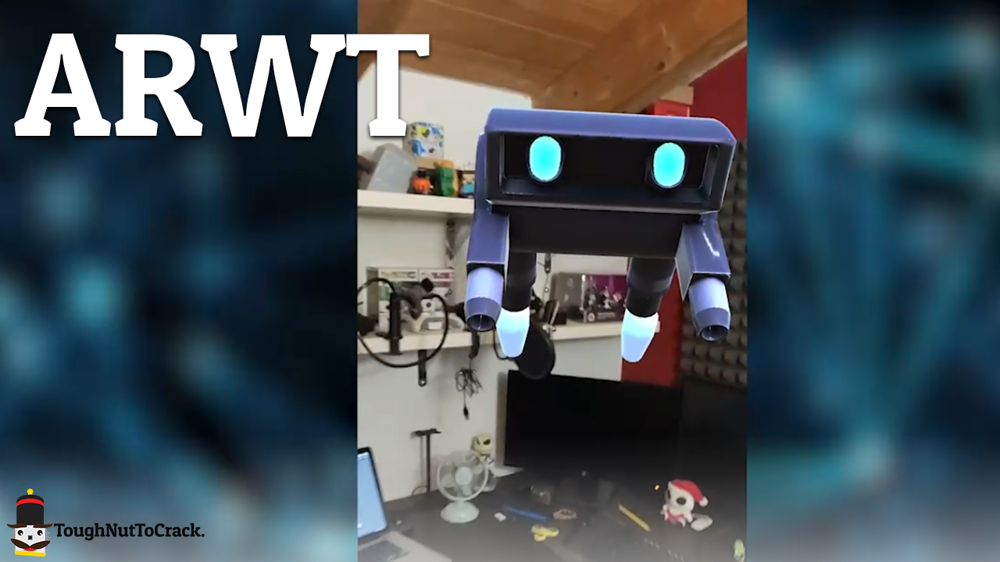

<h3 align="center">ARWT</h3>

One of the most requested things is to create AR experiences for the Web to avoid forcing the end-user to download a dedicated application. We all know how boring it can be downloading an application that we will use for a limited time. Therefore, you often risk losing a potential customer or limiting the spread of your AR experience.

Of course, there are some solutions for creating Web AR experiences; however, none of these tools offer the same convenience as a graphic engine as Unity. Given that Unity is the environment on which we are more experienced, and we have a great knowledge of the web ecosystem in the 3D field, we decided to create ARWT.

This library allows you to use Unity to build AR Web applications, working as a bridge between Unity and the best AR libraries available for the Web.

Our goal is to distribute the code for free and create a good community that supports and evolves the library to grow and stay up to date. At the moment, this project is carried out in our free time, and therefore has relatively slow growth. For this reason, we would like to gather all possible support to allow us to speed up the development of this library. More support will allow us to dedicate more time to implement this project, which will remain free and open source for anyone in any case.

<a href="https://toughnuttocrack.it/arwt" target="_blank">Check this link for the Documentation</a>

